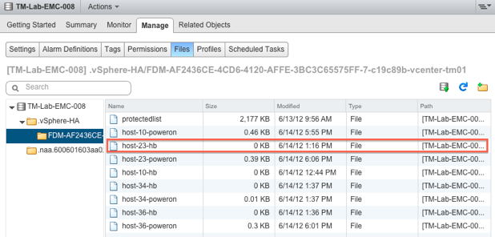
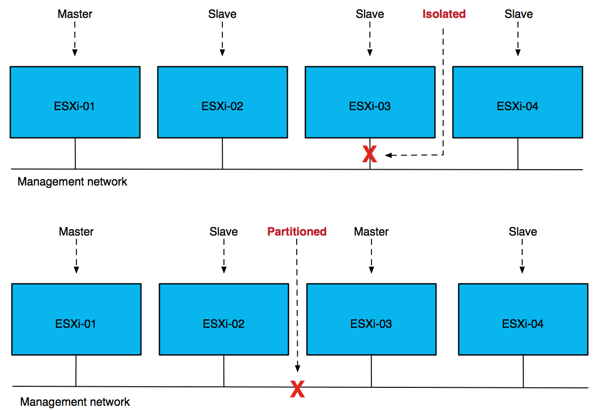

# Components of High Availability

There are three major components that form the foundation for HA:

* FDM
* HOSTD
* vCenter

The first and probably the most important component that forms HA is FDM (Fault Domain Manager). This is the HA agent.

The FDM Agent is responsible for many tasks such as communicating host resource information, virtual machine states and HA properties to other hosts in the cluster. FDM also handles heartbeat mechanism, virtual machine placement, virtual machine restarts, logging and much more.

## HOSTD Agent

One of the most crucial agents on a host is HOSTD. This agent is responsible for many of the tasks we take for granted like powering on virtual machines.

## vCenter

vCenter is the core of every vSphere Cluster and is responsible for many tasks these days. For our purposes, the following are the most important and the ones we will discuss in more detail:

* Deploying and configuring HA Agents
* Communication of cluster configuration changes
* Protection of virtual machines

vCenter is responsible for pushing out the FDM agent to the ESXi hosts when applicable. The push of these agents is done in parallel to allow for faster deployment and configuration of multiple hosts in a cluster. vCenter is also responsible for communicating configuration changes in the cluster to the host which is elected as the master. Examples of configuration changes are modification or addition of an advanced setting or the introduction of a new host into the cluster.

# Fundamental Concepts
* Master / Slave agents
* Heartbeating

Everyone who has implemented vSphere knows that multiple hosts can be configured into a cluster. A cluster can best be seen as a collection of resources. These resources can be carved up with the use of vSphere Distributed Resource Scheduler \(DRS\) into separate pools of resources or used to increase availability by enabling HA.

The HA architecture introduces the concept of master and slave HA agents. Except during network partitions, there is only one master HA agent in a cluster. Any agent can serve as a master, and all others are considered its slaves. A master agent is in charge of monitoring the health of virtual machines for which it is responsible and restarting any that fail. The slaves are responsible for forwarding information to the master agent and restarting any virtual machines at the direction of the master.

## Master Agent

One of the primary tasks of the master is to keep track of the state of the virtual machines it is responsible for and to take action when appropriate. In a normal situation there is only a single master in a cluster. A master will claim responsibility for a virtual machine by taking “ownership” of the datastore on which the virtual machine’s configuration file is stored.

### Election

A master is elected by a set of HA agents whenever the agents are not in network contact with a master.

The HA master election takes approximately 15 seconds and is conducted using UDP. The election process is simple but robust. The host that is participating in the election with the greatest number of connected datastores will be elected master.

After a master is elected, each slave that has management network connectivity with it will setup a single secure, encrypted, TCP connection to the master. One thing to stress here though is that slaves do not communicate with each other after the master has been elected unless a re-election of the master needs to take place.

Restarting virtual machines is not the only responsibility of the master. It is also responsible for monitoring the state of the slave hosts and reporting this state to vCenter Server. If a slave fails or becomes isolated from the management network, the master will determine which virtual machines must be restarted. When virtual machines need to be restarted, the master is also responsible for determining the placement of those virtual machines.

## Slaves

A slave has substantially fewer responsibilities than a master: a slave monitors the state of the virtual machines it is running and informs the master about any changes to this state.

The slave also monitors the health of the master by monitoring heartbeats. If the master becomes unavailable, the slaves initiate and participate in the election process. Last but not least, the slaves send heartbeats to the master so that the master can detect outages. Like the master to slave communication, all slave to master communication is point to point. HA does not use multicast.

## Files for both Slave and Master

Both the master and slave use files not only to store state, but also as a communication mechanism. We will now discuss the files that are created by both the master and the slaves. Remote files are files stored on a shared datastore and local files are files that are stored in a location only directly accessible to that host.

### Remote Files

The set of powered on virtual machines is stored in a per-host "poweron" file. It should be noted that, because a master also hosts virtual machines, it also creates a "poweron" file.

The naming scheme for this file is as follows: `host-number-poweron`

Tracking virtual machine power-on state is not the only thing the "poweron" file is used for. This file is also used by the slaves to inform the master that it is isolated from the management network: the top line of the file will either contain a 0 or a 1. A 0 \(zero\) means not-isolated and a 1 \(one\) means isolated. The master will inform vCenter about the isolation of the host.

## Heartbeating

Heartbeating is the mechanism used by HA to validate whether a host is alive. HA has two different heartbeating mechanisms. These heartbeat mechanisms allows it to determine what has happened to a host when it is no longer responding.

Network Heartbeating is used by HA to determine if an ESXi host is alive. Each slave will send a heartbeat to its master and the master sends a heartbeat to each of the slaves, this is a point-to-point communication. These heartbeats are sent by default every second.

When a slave isn't receiving any heartbeats from the master, it will try to determine whether it is Isolated.

### Datastore Heartbeating

Datastore heartbeating adds an extra level of resiliency and prevents unnecessary restart attempts from occurring as it allows vSphere HA to determine whether a host is isolated from the network or is completely unavailable. How does this work?

Datastore heartbeating enables a master to more determine the state of a host that is not reachable via the management network. The new datastore heartbeat mechanism is used in case the master has lost network connectivity with the slaves. The datastore heartbeat mechanism is then used to validate whether a host has failed or is merely isolated/network partitioned. Isolation will be validated through the "poweron" file which, as mentioned earlier, will be updated by the host when it is isolated. Without the "poweron" file, there is no way for the master to validate isolation. Let that be clear! Based on the results of checks of both files, the master will determine the appropriate action to take. If the master determines that a host has failed \(no datastore heartbeats\), the master will restart the failed host's virtual machines. If the master determines that the slave is Isolated or Partitioned, it will only take action when it is appropriate to take action. With that meaning that the master will only initiate restarts when virtual machines are down or powered down / shut down by a triggered isolation response.

By default, HA selects 2 heartbeat datastores – it will select datastores that are available on all hosts, or as many as possible.

In block based storage environments HA leverages an existing VMFS file system mechanism. The datastore heartbeat mechanism uses a so called "heartbeat region" which is updated as long as the file is open. On VMFS datastores, HA will simply check whether the heartbeat region has been updated. In order to update a datastore heartbeat region, a host needs to have at least one open file on the volume. HA ensures there is at least one file open on this volume by creating a file specifically for datastore heartbeating. In other words, a per-host file is created on the designated heartbeating datastores, as shown below. The naming scheme for this file is as follows: `host-number-hb`.

On NFS datastores, each host will write to its heartbeat file once every 5 seconds, ensuring that the master will be able to check host state. The master will simply validate this by checking that the time-stamp of the file changed.

## Isolated versus Partitioned

First, consider the administrator's perspective. Two hosts are considered partitioned if they are operational but cannot reach each other over the management network. Further, a host is isolated if it does not observe any HA management traffic on the management network and it can’t ping the configured isolation addresses.

When the master stops receiving network heartbeats from a slave, it will check for host "liveness" for the next 15 seconds. Before the host is declared failed, the master will validate if it has actually failed or not by doing additional liveness checks. First, the master will validate if the host is still heartbeating to the datastore. Second, the master will ping the management IP address of the host. If both are negative, the host will be declared Failed. This doesn't necessarily mean the host has PSOD'ed; it could be the network is unavailable, including the storage network, which would make this host Isolated from an administrator's perspective but Failed from an HA perspective.

# Restarting Virtual Machines
## Isolation Response and Detection
Today there are two isolation responses: "Power off", and "Shut down". In previous versions (pre vSphere 6.0) there was also an isolation response called "leave powered on", this has been renamed to "disabled" as "leave powered on" means that there is no response to an isolation event.

The isolation response features answers the question, "what should a host do with the virtual machines it manages when it detects that it is isolated from the network?" Let's discuss these three options more in-depth:

* Disabled (default) – When isolation occurs on the host, the state of the virtual machines remains unchanged.
* Power off – When isolation occurs, all virtual machines are powered off. It is a hard stop, or to put it bluntly, the "virtual" power cable of the virtual machine will be pulled out!
* Shut down – When isolation occurs, all virtual machines running on the host will be shut down using a guest-initiated shutdown through VMware Tools.

### Isolation of a Slave

HA triggers a master election process before it will declare a host is isolated. In the below timeline, "s" refers to seconds.

* T0 – Isolation of the host (slave)
* T10s – Slave enters "election state"
* T25s – Slave elects itself as master
* T25s – Slave pings "isolation addresses"
* T30s – Slave declares itself isolated
* T60s – Slave "triggers" isolation response

When the isolation response is triggered HA creates a "power-off" file for any virtual machine HA powers off whose home datastore is accessible. Next it powers off the virtual machine (or shuts down) and updates the host's poweron file. The power-off file is used to record that HA powered off the virtual machine and so HA should restart it.

### Additional Checks

Before a host declares itself isolated, it will ping the default isolation address which is the gateway specified for the management network, and will continue to ping the address until it becomes unisolated. HA gives you the option to define one or multiple additional isolation addresses using an advanced setting. This advanced setting is called _das.isolationaddress_ and could be used to reduce the chances of having a false positive.

# Adding Resiliency to HA

## Corner Case Scenario: Split-Brain

A split brain scenario is a scenario where a single virtual machine is powered up multiple times, typically on two different hosts. This is possible in the scenario where the isolation response is set to "Disabled" and network based storage, like NFS / iSCSI and even Virtual SAN, is used. This situation can occur during a full network isolation, which may result in the lock on the virtual machine's VMDK being lost, enabling HA to actually power up the virtual machine. As the virtual machine was not powered off on its original host (isolation response set to "Disabled"), it will exist in memory on the isolated host and in memory with a disk lock on the host that was requested to restart the virtual machine.

In case it does happen, HA relies on the "lost lock detection" mechanism to mitigate this scenario. In short ESXi detects that the lock on the VMDK has been lost and, when the datastore becomes accessible again and the lock cannot be reacquired, issues a question whether the virtual machine should be powered off; HA automatically answers the question with Yes.
